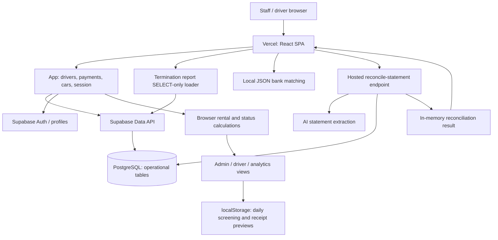

# Current System Architecture Discovery

Discovery date: **15 September 2026** (Asia/Kuala_Lumpur). Scope: existing implementation only; no redesign, feature recommendations, application changes or production mutations.

## Evidence boundary and production identity

The existing system is a React single-page application with direct Supabase database access, browser-side rental calculations and a Supabase statement-reconciliation Edge Function. Rental terms are embedded in driver records rather than a separately modelled agreement workflow. This report distinguishes executable source from comments, historical documentation and unverified hosted settings.

| Evidence | Result / confidence |
| --- | --- |
| Working tree | HEAD `c8ba89945b6e844774a536879bb396608a324fb8`, `feat: add eight-week termination review report to Analytics`. No tracked modifications at discovery start; `AGENTS.md` was already untracked. |
| Production frontend | GET of [production](https://eca-rental-service.vercel.app/) returned HTTP 200. All three referenced JS/CSS assets were fetched and were byte-identical to existing local `dist` files. |
| Production assets | `/assets/index-DCMSVM7k.js`, `/assets/vendor-DEHtj2nd.js`, `/assets/index-CnNW7EhA.css`. Main JS SHA-256: `d5a59c98884d8e5dca9db509521703252c08baa30cac02ffc1e90f9fe19f0eb6`. This establishes live/local artifact identity; a new source build was not performed during discovery. |
| Database identity | Existing handover identifies Supabase **RentalDatabase**, project `fjgbkfbdmrnnmfxjbelf`, Singapore region; the local configuration targets this project. Historical project health is not a current health check. [S10] |
| Live database metadata | Supabase connector rejected schema and Edge Function inventory reads with “You do not have permission to perform this action.” REST OpenAPI metadata requests using the configured frontend credential returned HTTP 401. No business rows were retrieved. |
| Database / server conclusions | Table usage and migration definitions below are source-backed. Current hosted table definitions, policies, grants, triggers, jobs, migration history, storage configuration and Edge Function version **could not be verified**. Absence in this repository is not proof of absence in production. |
| Execution | No login, payment write, bank upload, AI extraction, migration, deployment, notification or production workflow mutation was performed. The sole new deliverable is this report. |

The report is suitable for reviewing the visible implementation and its dependencies. It is **not a complete certified inventory of the inaccessible production database**. Evidence references `[S1]`–`[S13]` resolve in the source index near the end.

## 1. System architecture

### Technology and runtime

| Area | Existing implementation |
| --- | --- |
| Frontend | React 19, TypeScript, Vite 6, Tailwind CSS 4, Lucide icons and Recharts. Root-level `index.tsx` mounts `App.tsx`; operational UI is concentrated in `components/AdminDashboard.tsx`. Package declarations are version ranges, not a claim about future resolved versions. [S1, S2, S11] |
| Navigation | React state switches `LOGIN`, `DRIVER`, `ADMIN`; Admin state switches operational tabs. No Next.js App Router, Server Actions or separate application API route tree is used. Vercel rewrites paths to `index.html`. [S1, S11] |
| Client state | `App` owns drivers, cars, session and selected driver. Drivers and payments are fetched separately in 1,000-row pages, joined by driver ID in memory, and converted from database field names. Cars are fetched separately without pagination. Refreshes follow mutations; there is no database Realtime subscription in the inspected code. [S1] |
| Backend | Supabase Data API through `supabase-js`; most CRUD goes directly from the browser to tables. A Deno HTTP Edge Function handles statement extraction and matching. SQL reconciliation functions also exist in migration source but are not invoked by the current source runtime. [S1, S7, S8] |
| Database | PostgreSQL/Supabase. Operational references: `drivers`, `payments`, `cars`, `profiles`, `invoices`; migration-only snapshot entity `fleet_snapshots`. Base schema migrations for drivers/payments/cars/profiles are missing. [S1, S8] |
| Authentication | Supabase session restoration, auth state listener, password sign-in and sign-out are wired. Actual login routing also includes direct admin access and a client-only driver NRIC lookup; see permission map below. [S1, S3] |
| Storage | No Supabase Storage bucket API is called in current source. Expanded driver receipt previews are FileReader data URLs saved to browser localStorage. Bank files are selected in the browser and either parsed locally or sent to the Edge Function. Hosted bucket existence is unknown. [S3, S7] |
| Scheduling | No Vercel cron configuration or source SQL cron registration found. A browser timer checks for a Kuala Lumpur date change every 10 seconds and resets daily screening state. Rental obligations and historical trends are computed on demand. [S2, S8, S11] |
| Webhooks | No inbound payment/bank webhook, event handler or outgoing notification webhook found. The statement endpoint is user-invoked multipart/JSON HTTP processing, not evidence of an automatic bank feed. [S7] |
| Deployment | Source handover records GitHub `main` → Vercel frontend deployment. Supabase function/database releases are separate; committing a migration does not prove it ran. Local Vite uses port 3000. No verified staging/database branch topology is documented. [S10, S11] |

The Edge Function internals in the diagram describe checked-in source; the currently hosted revision could not be inspected. Existing handover records Gemini as the retained hosted provider, while local source also supports OpenAI. [S7, S10]

### Authentication and permissions

| Identity / role | Selection and visible capability | Enforcement established by evidence |
| --- | --- | --- |
| Driver | Login normalizes NRIC digits and searches already-loaded drivers, then sets the selected driver dashboard. | No driver Supabase sign-in, server identity check or ownership token is created by this path. Initial data fetching occurs on application mount, before this choice. [S1:26–154, 233–247] |
| Admin through Access UID | Login form supplies a fixed internal password argument. The matching handler grants local admin state for this argument and other shortcut conditions; failed password sign-in also falls back to local admin. | This is UI state assignment, not demonstrated authentication/authorization. Exact credential literals are intentionally omitted. [S3; S1:250–275] |
| Authenticated admin / staff | An existing Supabase session loads `profiles.role` by user ID. A profile query error normally falls back to staff. | Staff restrictions are component conditions. `App` CRUD handlers do not independently enforce `userRole`. Hosted RLS/grants determine whether requests are permitted, and remain unverified. [S1:157–230, 309–491] |
| Service-side reconciliation | Source creates a Supabase service-role client and loads drivers with nested payments. | No caller-specific role/ownership check is visible in the handler. Hosted gateway JWT verification settings and deployed code are unknown. [S7] |

In Admin, Driver List, Analytics and Bank Recon tabs/views and some financial drilldowns are admin-only. Staff sees obscured summary amounts. A retained effect redirects staff away from `CARS`, but no rendered Vehicles tab/page was found. Add Driver and active/delisted row payment/edit/delist/delete controls do not have corresponding local role guards. Therefore a hidden button must not be treated as proof that an operation is inaccessible. This is a description of current access behavior, not a proposed change. [S2:343–348, 1412–1457, 1505–1525, 1899–1910]

### Integrations and environment purposes

| Integration / variable name | Purpose and boundary |
| --- | --- |
| `VITE_SUPABASE_URL` | Browser database/auth endpoint. |
| `VITE_SUPABASE_ANON_KEY` | Browser Supabase API credential; also fallback bearer credential for the statement call when there is no auth session. Value not included. |
| `VITE_AI_PROVIDER` | Frontend provider wording only; does not select the backend extractor. |
| `SUPABASE_URL`, `SUPABASE_SERVICE_ROLE_KEY` | Hosted Edge Function's privileged database connection; server-side only. |
| `AI_PROVIDER` | Local Edge Function extractor selection; defaults to Gemini. |
| `GEMINI_API_KEY`, `GEMINI_MODEL` | Google statement extraction credential and model selection. |
| `OPENAI_API_KEY`, `OPENAI_MODEL` | Optional local source OpenAI extraction credential and model selection. Presence in source is not evidence enabled in production. |
| Google Gemini | Statement document bytes sent to generateContent by the source adapter. Existing handover says hosted Gemini retained. |
| OpenAI | Optional Responses-based PDF/image extraction with structured output validation and `store: false` in source. No live call or provider activation verified. |
| WhatsApp / telephone links | Expanded driver UI opens external contact links. Current typed/hydrated Driver lacks the `phone` field this component expects; a fallback contact destination is present. This is not a verified driver contact or message-delivery workflow. |
| GitHub / Vercel | Repository and frontend build/deployment. No current hosting credentials or settings changed. |
| Print / PDF | Browser print flows and PDF-related frontend dependency; no external report delivery service found. |

Only variable names and purposes are recorded. No secret values or customer records are included. [S3, S7, S10, S11]

## 2. Frontend / module map

| Module / page | Purpose | Main actions | Backend used | Database tables |
| --- | --- | --- | --- | --- |
| Login | Choose staff/admin or driver view | Access UID entry, NRIC lookup, session restoration, logout/reset flow | `App` auth and role lookup | `profiles`; already-fetched `drivers` |
| Active drivers / fleet | Current rental population and arrears queue | Search/filter by status/tag; add/edit driver; payment entry; delist; screening | `App` CRUD callbacks, browser calculations | `drivers`, `payments`; `invoices` after payment insert |
| Delisted drivers | Retain inactive accounts/history | Search, edit/payment controls; delete profile action | `App` callbacks | `drivers`, `payments`; invoice cascade declared in migration |
| Driver List | Admin-only active-driver directory | Sort identity/category; inspect contact/NRIC/plate fields and row actions | Hydrated driver props / parent callbacks | `drivers` |
| Driver rental form | Identity, vehicle plate and rental terms | Create/update dates, cycle, category, duration, rate, tags; plate is free text | Driver insert/update | `drivers` |
| Vehicle infrastructure (retained, not a reachable page found) | Car model, fetch and CRUD handlers remain | No rendered car table/modal or vehicle-selection control found; handlers support make/model/plate/expiry/notes | App car callbacks retained; current UI entry point not established | `cars` is fetched; driver plate separately stored |
| Payment modal / edit payment | Record rent cash and service credits | Enter amount/date/service claim/method; edit transaction | `App.handleUpdatePayment` / `handleEditPayment` | `payments`; new-payment path also upserts `invoices` |
| Invoice / collection widgets | Display generated obligations and urgency | Inspect due today, yesterday, older unpaid obligations, weekly/monthly targets | Browser `generateDriverInvoices` | Inputs from `drivers`, `payments`; does not read persisted `invoices` |
| Expanded driver detail | Account overview, payment feed and local attachments | Open payment modal; contact links; add/remove receipt preview; inspect six-period schedule | Payment callback only; other functions local | Hydrated driver/payments; receipts only in localStorage |
| Driver dashboard | Driver-facing account health/progress and debt | View status, payment-related information, projected interest; logout | Props and browser calculations | No independent table query |
| Analytics | Arrears, collections register, six-month charts and weekly detail | Select month, expand lists, inspect weekly performance | Browser aggregations from enhanced driver props | `drivers`, `payments`; generated invoices |
| Recommended for Termination | Evidence-based management review | Load/refresh full active ledger; expand evidence; print | Independent SELECT-only loader and deterministic calculation | `drivers`, `payments` |
| Bank Reconciliation | Compare uploaded statement deposits with payment ledger | JSON/document upload, match/re-evaluate, sender correction, manual link, print | Local matching or HTTP `reconcile-statement` | Input payment props; Edge Function source reads drivers/nested payments |

These are component/state views, not separate server-rendered routes. There is no dedicated agreement-signing, Promise-to-Pay, reminder record, recovery case or payment-gateway module in the inspected runtime. [S1–S7]

## 3. Database and data dependency map

### Tables and views

Physical constraints are listed only when migration source establishes them. Field names alone are not used to infer business meaning.

| Table / view | Purpose | Important fields and verified usage | Relations | Written by | Read by |
| --- | --- | --- | --- | --- | --- |
| `drivers` | Driver identity **and current rental terms** | `id`, `nric`, `name`, `email`, `address`, `car_plate`; `contract_start_date`, `contract_end_date`, `rental_cycle`, `contract_duration_weeks`, `rental_rate`, `category`; `is_delisted`, `delist_date`, `tags`; fetch ordered by `created_at`. Duration field is mapped to number of cycles, including months, despite its database name. | Payments joined on driver ID. Car association uses plate text, not a demonstrated FK. Invoice FK declared separately. | App create/update/delist/delete handlers | App; reconciliation source; termination loader |
| `payments` | Posted monetary entries and noncash service credits | `id`, `driver_id`, `date`, `amount` (cash in termination/analytics detail), `service_claim` (reduces debt), `payment_method`. Source adds numeric claim default 0 and text method default BANK TRANSFER. | Code joins `driver_id` to drivers; nested payment relation used by Edge Function. Base FK DDL unavailable. No invoice ID/allocation column used. | App payment insert/edit; driver-delete path deletes related payments | App-derived views; termination loader; Edge Function and SQL reconciliation |
| `cars` | Vehicle inventory model | `id`, `make`, `model`, `plateNumber`, `roadtaxExpiry`, `insuranceExpiry`, `inspectionExpiry`, `notes`. Retained App handlers pass Car objects directly to table mutations. Physical types and constraints unavailable. | Driver car plate is a separate stored string. No demonstrated cascade/synchronization. | Retained App car create/update/delete handlers; reachable UI not found | App fetch; no rendered inventory consumer found |
| `profiles` | Role for an authenticated account | `id`, `role`; query by Supabase session user ID. Expected UI role admin/staff. | Intended identity association is code-backed; actual FK to Auth not verified. | No profile writer found | `fetchUserRole` |
| `invoices` | Persisted copy of generated cycle allocations | Text `id` = driver ID + cycle index, `driver_id`, `cycle_index`, `due_date`, `amount`, `amount_paid`, `remaining_balance`, `status`, `created_at`. Migration status check: PAID/PARTIAL/UNPAID/CANCELLED/FUTURE. | Nullable UUID `driver_id` FK → drivers, ON DELETE CASCADE in migration | `syncDriverInvoicesToDb`, reached after new payment | No current frontend read found; hosted consumers unknown |
| `fleet_snapshots` | Daily fleet-status count structure | UUID `id`, unique `snapshot_date`, `good_count`, `mid_count`, `bad_count`, `created_at`. | No FK in migration | No runtime writer found | No runtime reader found; TS interface remains |
| Former `invoices` view | Historical possibility only | Invoice migrations begin by dropping a view of this name. No view definition is present. | Unknown | Historical / unknown | Unknown |
| Other historical metric view | Comments refer to SQL-view performance columns | App explicitly recomputes average/last lateness and velocity locally. Neither live view name nor current schema is established. | Unknown | Unknown | No current named-view read found |

Sources: [S1, S8, S9]. **All hosted schema details remain unverified.**

### Database functions, triggers and policies

| Object | Source-defined behavior | Caller / current status |
| --- | --- | --- |
| `public.reconcile_bank_statement(jsonb)` | Multiple `CREATE OR REPLACE` definitions; returns reconciliation JSON. Latest chronologically named full definition (`20260612000000_upgrade_bank_reconciliation.sql`) uses plate/name and cash/date/amount fallback matching, plus system-unsolved detection. PL/pgSQL `SECURITY DEFINER`. | No current runtime `.rpc()` call found. Both frontend and Edge Function perform JavaScript matching instead. Hosted definition/grants unknown. |
| `test_get_drivers()` | JSON aggregate of all `public.drivers`; `SECURITY DEFINER`. | Test/debug SQL definition; no current runtime caller found. Hosted presence/grants unknown. |
| Invoice policies | Migration enables RLS and declares `FOR ALL USING (true) WITH CHECK (true)`. | Source policy is permissive rather than owner/role-scoped. Effective hosted access also depends on grants, exposure and actual policies, which were inaccessible. |
| Fleet snapshot policies | Same all-rows/all-operations policy form after enabling RLS. | No runtime use found; deployment unverified. |
| Driver/payment/car/profile policies | Base policy definitions absent in available migrations. | Cannot establish real staff/driver restrictions from frontend role labels. |
| Database triggers | No `CREATE TRIGGER` found in repository SQL. | Hosted trigger inventory unavailable. Do not infer there are none. |
| Scheduled database jobs | No source registration found. | Hosted cron/extensions/jobs unavailable. No evidence that invoices or reminders are created by a hosted scheduler. |

Source reconciliation functions do not set an explicit `search_path` or show caller authorization or execute revocations. These are source facts, not proof of current public executability. [S8]

Migration history is incomplete and contains duplicate invoice scripts, repeated reconciliation replacements, short/long timestamp variants and empty companion migrations. An additional `app/applet` tree contains historical scripts/migrations, not the current Vite entry point. File ordering cannot establish what production applied. Invoice scripts also drop a prior view with CASCADE; they were **not run** during this discovery. [S8, S11]

### Derived figures and status copies

| Concept | Existing representations |
| --- | --- |
| Lifetime paid | App `totalAmountPaid` sums all loaded payment amounts plus service claims. It does not apply a reference-date filter there; balance/invoice routines independently filter payments to their reference date. |
| Rental principal | `calculateDriverMetrics`: elapsed due cycles × rate, reduced by FIFO cash + claims. `generateDriverInvoices`: a duration-limited list, each with allocated paid/remaining amounts. |
| Outstanding | Metrics expose `principalOutstanding` and `totalOutstanding` as the same base-only figure; `calculateActiveBalance.baseValue` wraps it. Invoice rows hold a separate persisted remaining value; Analytics also reconstructs historical invoice balances. |
| Penalties | Browser projection at daily rate `0.18 / 365`, compounded on allocations according to timing. Not included in `totalOutstanding`; no stored penalty ledger or penalty-payment allocation found. |
| Payment status | Generated PAID/PARTIAL/UNPAID/FUTURE; persisted invoice copy; urgency buckets; heuristic expanded-detail statuses. These are not a single shared stored state. |
| Driver status | `is_delisted`/`delist_date`, contract end date, calculated GOOD/MID/BAD, habits/velocity/debt trend, driver health/trusted indicators and termination recommendation are separate concepts. |
| Historical data | Dashboard debt trends and termination balances are reconstructed using **current** contract fields. No contract-version history is used. Snapshot table is not used by those code paths. |

## 4. Actual workflow mapping

### A. Rental / driver onboarding

**User action → UI:** staff creates a driver through the Admin rental form and enters identity, plate, category, start/end dates, cadence, duration and rate. When both dates are available the UI estimates duration using days/7 or days/30. That estimate is distinct from calendar-month invoice generation. [S2]

**Backend logic → database change:** `handleCreateDriver` maps fields and inserts one `drivers` row with `is_delisted: false`; blank optional email/address/end date become null. No separate rental/agreement entity, signature, deposit approval, activation transaction or initial invoice batch is created by this handler. [S1:387–411]

**Automation → result:** App reloads drivers/payments; the row enters the non-delisted population. Calculations create a due obligation on the contract start date and each subsequent weekly/calendar-month cycle. A future start can therefore appear in the active population before a balance is due. “Active” is primarily not-delisted, not an agreement lifecycle approval state.

Vehicle CRUD handlers and form state remain, but a rendered vehicle-management page or car form was not found. Driver plate entry is free text and writes `drivers.car_plate`; no demonstrated database vehicle-reservation transaction or FK enforcement ties the two records together. Editing contract fields changes later reconstructions; this path does not regenerate persisted invoices. The submit handler checks nonempty name/NRIC/plate and an exact duplicate NRIC on creation; it also uses absolute date difference when computing duration. This is not a verified agreement approval or date-validity workflow. [S1:413–468; S2:890–940, 1978]

### B. Invoice / rental amount and outstanding

**User action → UI:** opening/refreshing operational views or changing the ledger supplies current driver terms and payment history to browser calculators.

**Backend logic:** normal balance computation has no server calculation call. [S4]

1. Due dates start on commencement. Weekly cycles advance seven days; monthly cycles use JavaScript calendar-month arithmetic.
2. Metrics count cycles through reference-day end. New obligations stop strictly before contract end or the effective delist date. Delist fallback is contract end, then contract start if no delist date exists.
3. Dated cash and service claims available by the reference day are consumed oldest-payment-first against oldest obligations. No persisted payment-to-invoice allocation is read.
4. Base remaining principal is the operational outstanding. Cycles owed is base outstanding/rate. Overpayments can cover later generated invoices, but principal outstanding is not a negative credit balance display.
5. Penalty projection uses a separate compounding calculation. Executable `gracePeriodDays` is 1 and reference time is day-end; nearby comments contradict one another about grace days. The expression, not those comments, is the evidence for actual behavior. New principal stops at contract end/delist, while the penalty calculation still uses the reference date for unpaid principal.

**Database change → automation → result:** viewing produces no database invoice write. `generateDriverInvoices` creates IDs and statuses in memory over recorded `contractDuration`. Only the payment-insert follow-up calls the invoice upsert path identified here. No periodic invoice scheduler is established.

Important distinction: metrics can accrue past recorded duration when no explicit end exists; generated invoice lists stop at recorded duration. A synthetic read-only execution using weekly RM100, duration 2, start 1 August, RM50 cash + RM25 claim and reference 22 August returned **4 metric cycles/RM325 base outstanding**, but **2 generated invoices/RM125 remaining**. Setting end date 15 August made both count two obligations, excluding the obligation on that end date. This is an example of existing behavior, not customer data or a proposed rule. [S4]

### C. Payment recording and editing

**User action → UI:** staff opens Payment from a driver row/detail and submits date, cash, service claim and method. Types include BANK TRANSFER, CASH DEPOSIT and CLAIM. [S2, S9]

**Backend logic → database change:** App first updates React state optimistically, then inserts `payments(driver_id, amount, service_claim, date, payment_method)`. On success it reloads source data and prepares a recalculated driver containing the new payment. It generates invoices and upserts them by ID in batches of 100. These are separate requests, not one database transaction. Invoice upsert error results are not inspected. [S1:291–347]

**Automation → result:** refreshed payments feed balances, statuses, trends and analytics. No receipt email, reminder cancellation, PTP completion or automatic bank matching is called.

**Edit variant:** an existing payment is optimistically replaced, then updated by payment ID and source data is reloaded. This handler **does not call invoice synchronization**. Driver term edits and delisting likewise do not synchronize invoice copies. Shortening an agreement does not delete old invoice rows through the upsert routine. [S1:349–448]

Service claims act as debt-reducing value in balances. The termination report distinguishes them from cash; some other total-collection displays add them to cash. A payment-method label is not a separate payment gateway transaction or evidence of funds received from a bank.

### D. Payment monitoring

| Display / decision | Actual rule and scope | Persisted change |
| --- | --- | --- |
| Generated invoice PAID | Remaining principal ≤ RM0.01 | None on viewing; may be copied to invoices after payment insert |
| PARTIAL | Positive allocation with principal still remaining; tested before future-date condition | Same |
| FUTURE | Unallocated invoice due after reference day | Same; advance allocation can make a future obligation PAID/PARTIAL |
| UNPAID | Remaining principal with no allocation and no future-date classification | Same |
| CANCELLED | Present in type/schema, but generator stops before effective end instead of emitting cancelled rows | No current cancellation writer found |
| Must collect today | Non-PAID generated invoice due today | None |
| Yesterday due | Despite the variable/label, non-PAID invoice due from today minus 3 through today minus 1, inclusive | None |
| Overdue queue | Non-PAID invoice earlier than today minus 3 (at least four calendar dates old) | None; differs from generic unpaid/partial status |
| GOOD/MID/BAD | GOOD if no principal owed; MID if positive below threshold; BAD at ≥3 weekly cycles or ≥1.1 monthly cycles | Browser derived, not `drivers.status` write |
| Missing/recent payment alert | Separate last-payment-gap logic; top active-driver alerts at ≥8 days | None; not confirmation of a missing receipt |
| Habit / momentum | Recent payment gaps and Nth-transaction-vs-Nth-due-date lateness. This is transaction-count based, not cash-weighted FIFO allocation | None |
| Termination report FULL/PARTIAL/ZERO | Period cash coverage against rent due; service claims excluded; periods without rent due do not count as failures | None |

Sources: [S2:387–465, 532–620; S4; S5; S6]. Dates are largely constructed in Kuala Lumpur time, but implementation also uses browser-local Date operations and reconciliation explicitly adds eight hours; a universal server-owned business clock is not present.

### E. Reminder / collection / follow-up

**User action → UI:** staff reviews arrears/urgency/risk indicators and can mark a driver screened, open payment entry or use external contact links. “Follow up” is a displayed operational cue. [S2, S3]

**Backend logic → database change:** screened driver IDs and date are written to `localStorage.eca_rental_screening_status`, not to Supabase. Receipt previews are stored under a per-driver localStorage key. Uploads receive `tx-manual-...` keys; the payment feed looks up payment IDs, and its Bind Receipt button only opens the picker. Thus storing a preview does not establish a working payment-to-receipt association. Contact links do not store a call/message result. [S3:32–102, 285–287, 343–350]

**Automation → result:** mounting the dashboard restores screening for the current Kuala Lumpur date; a 10-second date-check timer clears it on date change. This timer runs only while the dashboard is mounted. It is not a server reminder scheduler and does not send messages.

No source-backed reminder creation record, due time, assigned collector, contact history, sent/delivered status, escalation queue or follow-up completion ledger was found. Local screening does not synchronize between staff devices. Browser cache-clearing can remove it and receipt previews. Existing external/offline staff processes are not established by this discovery.

### F. Promise to Pay

| Required stage | Existing implementation finding |
| --- | --- |
| Creation | No dedicated PTP form, handler or typed record found |
| Promised date / amount | No dedicated fields referenced by current source |
| Status | No PTP status enum, persistence or derived rule found |
| Follow-up | No PTP queue or scheduled evaluator found |
| Failed promise | No overdue-promise transition or escalation found |
| Staff visibility | No dedicated PTP page/card found; generic driver tags are not treated as a verified PTP model |

**Source of truth unclear.** The accessible code does not implement this lifecycle. Inaccessible database objects or off-system arrangements cannot be ruled out. The termination report expressly asks management to check arrangements outside the system; that checklist does not create or track them. [S1–S9]

### G. Driver termination / vehicle recovery

There are two distinct existing flows.

**Management review:** Analytics → Recommended for Termination → SELECT active drivers and their complete payment ledger → calculate the latest 56 Kuala Lumpur calendar days → display qualifying accounts and evidence → optional print. It writes no driver status, recommendation row, notice or recovery task. [S6]

The report uses cash-coverage failures, outstanding change/persistence, payment gap, oldest unpaid invoice and cash-weighted lateness. It excludes inactive/invalid/insufficiently observed accounts, ended agreements and post-duration accrual cases. Recovery/current strong coverage can exclude an account. Recommendations require combined conditions, not merely the dashboard BAD label or a score. Weekly and monthly accounts have different observation rules; the latest open weekly block is excluded from the completed-period repetition test. Full implemented thresholds are documented in `docs/termination-report.md` and source. [S6, S12]

The report includes management checks for unrecorded receipts, external arrangements, approved downtime and required notices. These are instructions for human review, not stored confirmations.

**Actual delisting:** staff uses a driver row's delist action → App writes `is_delisted=true`, `delist_date=today` → reload → row enters delisted view and new principal stops before that effective date. Existing debt/history remains. No vehicle-recovered status, recovery appointment, notice dispatch, agreement closure record or car inventory update is performed by the handler. [S1:439–448]

**Deletion is separate:** driver deletion first deletes associated payments and then the driver in separate requests; migration source declares invoice cascade on driver deletion. It is not a termination audit workflow. This operation was inspected only, never executed. [S1:480–491, S8]

### H. Bank reconciliation (related payment workflow)

**User action → UI:** upload statement JSON or a document; inspect paired/unpaired/system-unsolved results; edit sender or manually link/re-evaluate a result. [S7]

**Backend logic:** JSON files are parsed and matched locally against hydrated payment history. Other selected documents are POSTed as multipart data to `reconcile-statement`, with session token or frontend credential fallback. The source handler invokes its selected extractor, normalizes rows and separates deposits/withdrawals, then reads drivers and nested payments with a service-role client.

Both source JavaScript matchers use staged amount/name/plate/date matching and wider date windows, with cash-deposit passes. The SQL RPC is a third, materially different matching implementation, not the invoked source code path. The deployed Edge Function revision is unknown.

**Database change → automation → result:** the checked-in handler is read-only; matched/unmatched results and manual corrections stay in React state. No payment is inserted, no persistent reconciliation link/audit batch is written, and there is no automatic bank feed. Any later payment entry uses the separate payment form. [S7, S8]

## 5. Consolidated workflow dependency matrix

| Workflow step | Frontend | Backend | Database | Automation | Status changed | Next step |
| --- | --- | --- | --- | --- | --- | --- |
| App initial load | App | Data API SELECT; optional Auth session | drivers/payments/cars; profiles for session | Mount fetch | Local view/session | Login or dashboard |
| Driver lookup | Login → DriverDashboard | Client NRIC match | Already-loaded drivers | None | Local selected driver/view | Read account |
| Create rental | Admin driver form | App insert | drivers | Refetch and recalculate | is_delisted=false | Active monitoring |
| Edit terms / plate | Admin edit | App update | drivers | Refetch; history reconstructed from current terms | Dates/rate/cycle/tags etc. | Recalculate obligations |
| Vehicle infrastructure | No rendered entry point found | Retained App CRUD | cars | Refetch if handlers invoked | Inventory fields if invoked | Actual operational UI path unestablished |
| Generate due obligations | Admin/Analytics | Browser generators | Reads hydrated terms/payments | On render/data recomputation | In-memory invoice statuses | Collection queue |
| Record payment | Payment modal | App insert | payments | Refresh then invoice batch upsert | Ledger entry; derived statuses | Review balance |
| Synchronize invoice copy | No separate page | App upsert | invoices | After new payment only in traced path | Persisted paid/remaining/status | No current invoice-table reader |
| Edit payment | Payment history/modal | App update | payments | Refresh, no invoice sync | Transaction and browser derived status | Review balance |
| Evaluate arrears/urgency | Admin | Metrics + generated invoices | Hydrated drivers/payments | On-demand calculation | Local GOOD/MID/BAD and due buckets | Staff review/payment |
| Screen driver | Admin | Browser only | None; localStorage | 10-second date check/reset | Local screened IDs | Next driver / next day |
| Contact / attach preview | Expanded detail | Browser links/FileReader | None; localStorage receipt | User-initiated | No shared collection state | External contact / payment form |
| Promise to Pay | No implementation found | None found | Unknown/no referenced entity | None found | None found | Not established |
| Read analytics | Analytics | Browser aggregations | Hydrated drivers/payments | In-memory historical reconstruction | No stored status | Inspect reports |
| Review termination | Analytics report | SELECT loader + report builder | drivers/payments | Full refresh; no schedule | Derived recommendation only | Management review |
| Delist | Admin row | App update | drivers | Refetch | is_delisted + delist_date | Delisted view/debt review |
| Delete driver | Delisted row/action | Sequential App deletes | payments then drivers; invoice FK source | Refetch | Records removed if requests succeed | No recovery case created |
| Reconcile JSON | Bank Reconciliation | Browser matcher | Loaded payment ledger | User upload/re-evaluate | React match result | Manual review |
| Reconcile document | Bank Reconciliation | Hosted endpoint; checked-in source AI + SELECT | drivers/nested payments | User upload only | Returned match result | Review/print/separate payment entry |

## 6. Potential overlap — observation only

Every item below is labelled **Potential overlap — requires business review**. No removal, merge, redesign or business-rule recommendation is made.

| Observation | Existing evidence / significance |
| --- | --- |
| **Potential overlap — requires business review:** balance and invoice generation | `calculateDriverMetrics` and `generateDriverInvoices` separately allocate payments and use different duration boundaries. Analytics historical arrears follows invoices; current active balance follows metrics. Synthetic divergence is documented above. [S4, S5] |
| **Potential overlap — requires business review:** persisted versus regenerated invoices | Payment insertion upserts calculated figures; ordinary UI reads recalculate from drivers/payments. Payment edits and term/delist changes do not synchronize that copy. Current consumers outside the repository are unknown. [S1] |
| **Potential overlap — requires business review:** expanded detail schedule | Six recent periods are synthesized relative to today, using a 30-day monthly approximation and `24*60*65*1000` multiplier. It expects `weeklyRate`, absent from the normal typed/hydrated driver model, and assigns heuristic PAID/PARTIAL/OVERDUE. This is separate from the contract-start FIFO generator. [S3] |
| **Potential overlap — requires business review:** collection figures | Monthly collections register adds cash + service claims; chart cash inflow and termination coverage distinguish them; invoice-based collected amounts are allocations, not receipt-date cash totals. Similar labels have different scopes. [S5, S6] |
| **Potential overlap — requires business review:** performance and termination indicators | GOOD/MID/BAD, payment-gap alerts, Nth-payment momentum, debt streaks, driver health/trusted indicators and termination evidence all describe payment performance with different rules. They are not equivalent termination decisions. [S2, S3, S4, S6] |
| **Potential overlap — requires business review:** reconciliation logic | Browser JSON matcher, Edge Function JavaScript matcher and repeatedly revised SQL RPC contain related responsibilities with different loading/matching behavior. Only the first two are runtime source paths. [S7, S8] |
| **Potential overlap — requires business review:** historical snapshots | `fleet_snapshots` structure coexists with on-demand dashboard/analytics/termination reconstruction; no current runtime snapshot-table caller found. [S2, S5, S6, S8] |
| **Potential overlap — requires business review:** inactive/end state | `is_delisted`, `delist_date` and contract end date all influence account interpretation. A non-delisted driver can have an ended contract; report eligibility handles that separately. [S1, S4, S6] |
| **Potential overlap — requires business review:** repeated operational entry points | Row Payment and expanded-detail Log Payment reach the same callback. Screening/contact/payment are separate staff actions without one stored follow-up lifecycle. [S2, S3] |
| **Potential overlap — requires business review:** vehicle association | Fleet plate and driver car_plate are separately stored; no demonstrated relational synchronization. [S1, S9] |

No duplicated PTP records or multiple reminder-delivery engines can be established because no implemented PTP/reminder lifecycle was found in accessible source.

## 7. Current sources of truth

“Current source” below means the authoritative input used by the traced application, not certification that other hosted systems do not exist.

| Business concept | Current source of truth | Other copies / derived data |
| --- | --- | --- |
| Driver | `drivers` rows as read by App | Hydrated React objects; report-specific selected fields |
| Vehicle | `cars` for inventory; `drivers.car_plate` for a driver's assigned plate | **Source of truth unclear** for enforced assignment consistency; no verified FK/history |
| Rental obligation | Current driver start/end/cadence/rate and ledger are inputs to browser calculations | Duration-limited generated invoices and uncapped metric accrual can diverge; **Source of truth unclear** where these disagree |
| Invoice | Displayed operational invoices are generated by `generateDriverInvoices` | `invoices` table receives a copy after payment insertion; expanded schedule is separate. **Source of truth unclear** for one durable authoritative invoice ledger |
| Payment | `payments` entries | In-memory payment histories, amount+claim totals, inferred invoice allocations; bank matches do not create payment records |
| Outstanding balance | Operational active figure: `calculateActiveBalance` → `calculateDriverMetrics` using driver terms and dated ledger | Invoice remaining balances, historical Analytics reconstruction, termination cents-based reconstruction; **Source of truth unclear** as one universal persisted balance |
| Promise to Pay | **Source of truth unclear** — no referenced model/workflow found | Off-system arrangements not inspectable |
| Reminder / collection status | Browser-local screened IDs for daily screening; calculated due/arrears queues | **Source of truth unclear** for shared reminder/contact/collection case status; no persistent lifecycle found |
| Driver status | `drivers.is_delisted` and effective end dates for lifecycle; financial GOOD/MID/BAD is derived separately | Health, habit, momentum, urgency and recommendation labels have distinct meanings |
| Termination recommendation | Current SELECT snapshot plus `buildTerminationReport` | Printed output and local component state only; not a termination action |
| Cash collection | `payments.amount` for cash-specific report calculations | Some summary totals include `service_claim`; invoice allocation totals use obligation dates |
| Receipt attachment | Per-browser localStorage data URL | No verified shared document repository or durable payment attachment relation |
| Reconciliation result | Current uploaded file + system ledger + selected runtime matcher | Local manual match state; historical SQL implementation; no persistent approved reconciliation record found |

## 8. Verification and unresolved production coverage

### Checks completed

- Read runtime entry point, all operational components, calculation helpers, relevant types, SQL migration/function sources, deployment configuration and existing handover/report documentation.
- Compared production JS/CSS bytes against existing local build artifacts; all three matched.
- Traced database access and mutation call sites; distinguished source comments from invoked code, especially the unused SQL RPC and simulated expanded invoice schedule.
- Executed the existing TypeScript calculation helpers in memory against synthetic records to confirm duration/ending-boundary divergence. No fixture or source file was created and no customer data was used.
- Reviewed independent frontend/database findings and cross-checked consequential payment, login, invoice-sync and termination boundaries against source.
- Did not run a production write test, AI extraction, rebuild, migration or broad application test suite: the deliverable is documentation and source remained unchanged. This does not claim end-to-end production workflow execution.

### Areas where architecture remains unclear

1. Full hosted schema, views, constraints, relationships, indexes, triggers, grants, RLS and applied migration order.
2. Hosted Edge Function revision, caller authentication settings, effective provider/model and configuration; the source/hosted distinction is especially relevant to optional OpenAI support.
3. Existence of hosted cron jobs, Storage buckets, dashboard-created integrations or external consumers of invoice/snapshot/RPC objects.
4. Effective database permissions for anonymous/admin/staff sessions; frontend login state cannot answer this.
5. Whether staff maintain promises, notices, collection cases or vehicle-recovery records elsewhere.
6. Shared authoritative invoice/obligation/balance definition when the existing generators differ, and whether external systems read persisted invoice copies.
7. Historical contract/assignment changes: current source reconstructs past figures from current terms and has no referenced versioned agreement history.
8. Current Vercel account settings, environment topology and exact production deployment-to-commit metadata beyond the verified static artifact match.

These are evidence limitations for the later review, not feature proposals.

## Source index

Line references describe the files at the recorded HEAD; supporting local documentation may describe earlier verification dates.

| ID | Evidence |
| --- | --- |
| S1 | [App.tsx](<C:/Users/user/Documents/Codex/ECA EHAILING/App.tsx:26>) — fetch/hydration 26–154; auth 157–285; invoice sync 291–307; payment insert/edit 309–385; driver/car CRUD 387–491; view wiring 561–600. |
| S2 | [AdminDashboard.tsx](<C:/Users/user/Documents/Codex/ECA EHAILING/components/AdminDashboard.tsx:61>) — props/mutations; local screening 287–340; role restriction 343–348; duration 362–383; metrics/trends 387–465; collection invoices/urgency 532 onward; payment submit 803–821; active row actions/detail 1899–1921. |
| S3 | [LoginView.tsx](<C:/Users/user/Documents/Codex/ECA EHAILING/components/LoginView.tsx:17>), [DriverDashboard.tsx](<C:/Users/user/Documents/Codex/ECA EHAILING/components/DriverDashboard.tsx:22>), [ExpandedDriverDetails.tsx](<C:/Users/user/Documents/Codex/ECA EHAILING/components/ExpandedDriverDetails.tsx:32>) — login, driver indicators, local receipt/simulated schedule/contact. |
| S4 | [utils.ts](<C:/Users/user/Documents/Codex/ECA EHAILING/utils.ts:14>) — metrics 14–218; active-balance wrapper 220–227; payment habits 236 onward; momentum 270 onward; invoice generation 320 onward. |
| S5 | [AnalyticsView.tsx](<C:/Users/user/Documents/Codex/ECA EHAILING/components/AnalyticsView.tsx:24>) — active arrears, monthly cash/claim collections, six-month invoice snapshots and weekly performance; report embedded at 317. |
| S6 | [TerminationReport.tsx](<C:/Users/user/Documents/Codex/ECA EHAILING/components/TerminationReport.tsx:136>), [terminationReportData.ts](<C:/Users/user/Documents/Codex/ECA EHAILING/terminationReportData.ts:4>), [terminationReport.ts](<C:/Users/user/Documents/Codex/ECA EHAILING/terminationReport.ts:68>) — loader, eligibility, cash coverage, FIFO and derived recommendations. |
| S7 | [BankReconciliation.tsx](<C:/Users/user/Documents/Codex/ECA EHAILING/components/BankReconciliation.tsx:913>), [Edge handler](<C:/Users/user/Documents/Codex/ECA EHAILING/supabase/functions/reconcile-statement/index.ts:13>), [Gemini adapter](<C:/Users/user/Documents/Codex/ECA EHAILING/supabase/functions/reconcile-statement/gemini.ts:2>), [OpenAI adapter](<C:/Users/user/Documents/Codex/ECA EHAILING/supabase/functions/reconcile-statement/openai.ts:2>) — uploads, provider processing, privileged SELECT and matching. |
| S8 | [Invoice migration](<C:/Users/user/Documents/Codex/ECA EHAILING/supabase/migrations/20260728000000_create_invoices.sql:1>), [snapshot migration](<C:/Users/user/Documents/Codex/ECA EHAILING/supabase/migrations/20260526000001_create_fleet_snapshots.sql:4>), [latest named SQL reconciliation](<C:/Users/user/Documents/Codex/ECA EHAILING/supabase/migrations/20260612000000_upgrade_bank_reconciliation.sql:2>), [test RPC](<C:/Users/user/Documents/Codex/ECA EHAILING/supabase/migrations/20260521000012_test_query.sql:1>); related migrations in the same directory. |
| S9 | [types.ts](<C:/Users/user/Documents/Codex/ECA EHAILING/types.ts:2>) — Car/Driver/Payment/Invoice client contracts. |
| S10 | [Production handover](<C:/Users/user/Documents/Codex/ECA EHAILING/docs/production-handover.md:1>) — historical project/release/provider identity. Where earlier README deployment statements conflict, this later release record is the stronger evidence. |
| S11 | [package.json](<C:/Users/user/Documents/Codex/ECA EHAILING/package.json:1>), [vite.config.ts](<C:/Users/user/Documents/Codex/ECA EHAILING/vite.config.ts:1>), [vercel.json](<C:/Users/user/Documents/Codex/ECA EHAILING/vercel.json:1>), [supabaseClient.ts](<C:/Users/user/Documents/Codex/ECA EHAILING/supabaseClient.ts:1>). |
| S12 | [Termination report behavior](<C:/Users/user/Documents/Codex/ECA EHAILING/docs/termination-report.md:1>) — full existing recommendation thresholds and limitations. |
| S13 | [Frontend environment example](<C:/Users/user/Documents/Codex/ECA EHAILING/.env.example:1>), [function environment example](<C:/Users/user/Documents/Codex/ECA EHAILING/supabase/functions/.env.example:1>), [README](<C:/Users/user/Documents/Codex/ECA EHAILING/README.md:1>) — variable purpose/source deployment distinctions. No real credential file is linked. |

## Architecture Summary

1. **Main modules:** login; active/delisted drivers with embedded rental terms; Driver List; payment entry/history; calculated invoices/collection queue; expanded driver details; driver dashboard; Analytics; eight-week termination review; bank reconciliation. Vehicle data/CRUD infrastructure remains, but no reachable vehicle-management page was found.
2. **Main workflows:** driver/term creation → calculated obligations → manual cash/claim recording → refreshed balances and status; browser-local screening/contact; independent termination review → separate manual delisting. Bank reconciliation inspects a statement and ledger without posting payments.
3. **Main database entities:** operational references to drivers, payments, cars and profiles; invoice-copy and fleet-snapshot migrations; reconciliation/debug SQL functions. Complete production schema remains inaccessible.
4. **Automations:** browser recalculation/refetch, payment-insert invoice synchronization and daily screening date reset. No source-backed scheduled reminders, PTP evaluator, automatic collection escalation or bank webhook found; hosted job inventory unverified.
5. **Current sources of truth:** drivers hold current identity/rental terms; payments hold cash/claim ledger; cars hold inventory. Most balances/statuses are derived. A universal invoice/balance authority and shared reminder/PTP state are unclear.
6. **Potential overlapping responsibilities:** parallel balance/invoice representations; heuristic detail schedule; cash versus cash-plus-claim totals; several financial-risk labels; three reconciliation implementations; persisted snapshot structure versus reconstructed history. **Potential overlap — requires business review.**
7. **Areas where architecture is unclear:** live schema/RLS/jobs/storage/function revision and external consumers; effective role enforcement; off-system arrangements/recovery; historical contract versions; agreement/vehicle consistency and conflicting invoice/balance boundaries. No system behavior was changed.
